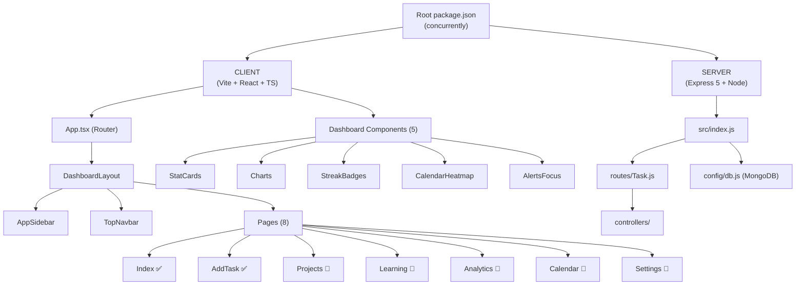

# Project Name : HANDY | Project Task and Learning Management Application 

---

## Project Overview
HANDY is a full-stack task and learning management application designed to streamline personal productivity through structured project tracking, progress analytics, and streak-based motivation. It features a modern React + Vite client with a scalable Express and MongoDB backend for efficient data handling. The platform centralizes tasks, learning plans, and performance insights in a clean, dashboard-driven workflow.

---

## ⏱️ Timeline

- **Duration**: 14 days
- **Dead Line**: 22 February 2026 - 8 March 2026
- **Completed**: under Development

---

## GitHub Badges


---

## Tech Stack
- **Framework**: React
- **Build Tool**: Vite
- **Language**: JavaScript (ES6+)
- **Styling**: Tailwind CSS
- **Package Manager**: pnpm

---

<!-- ## Features

- Modern Hero Section
- Featured & New released Product
- Footer
- Reach Products List Page
- Product Details Page
- Not Found Page
- CI/CD for Cpanel Deployment
---

## Reminder

- no DataBase
- no login 
- no admin
- no checkout
- no order -->

<!-- ---

## 📁 Project Structure
```txt
src/
├── assets/        # Static assets (images, icons)
├── components/    # Reusable UI components
├── pages/         # Application pages/views
├── index.css/        # Global styles
├── App.jsx
└── main.jsx
```
--- -->

## 🏗️ System Architecture



---

## Deployed

this website is deployed to shared hosting.

---

## Deployed
this website is deployed to cpanel. also intigrated CI/CD model for automation and utilise time of deployment process in update and upgrade.

**Deployment flow:**

Developer
↓ (push to main)
GitHub Actions
↓ (install dependencies & build)
Static Build Artifacts
↓ (FTP upload)
cPanel Hosting
↓ (serve static files)
End User (Browser)

---

## Screenshots

| Name | Screenshot |
|------|------------|
| Home Page |  |
| Product Details Page |  |
| ProductList Page |  |
| NotFound_Desktop Page |  |

---

## Prerequisites
- **Node.js** >= 18
- **npm** >= 9

---

## Installations:

### [1]: Clone the munna repository

```bash
git clone git@github.com:yasinarafatajad/munna.git;
cd munna
```

### [2] Install pnpm
```bash
npm install -g pnpm

```

### [3] Packege install
Install the required packages:
```bash
pnpm install

```
### [4] Development
Start the development with hot module replacement:
```bash
pnpm dev

```

### [5] Build for Production
Start the production :
```bash
pnpm build
    
```

---

## 👤 Author
**Yasin Arafat Azad**  
Full-Stack Web Developer (MERN)

---

## 📄 License
This project is licensed under the **MIT License**.  
See the `LICENSE` file for details.

---
