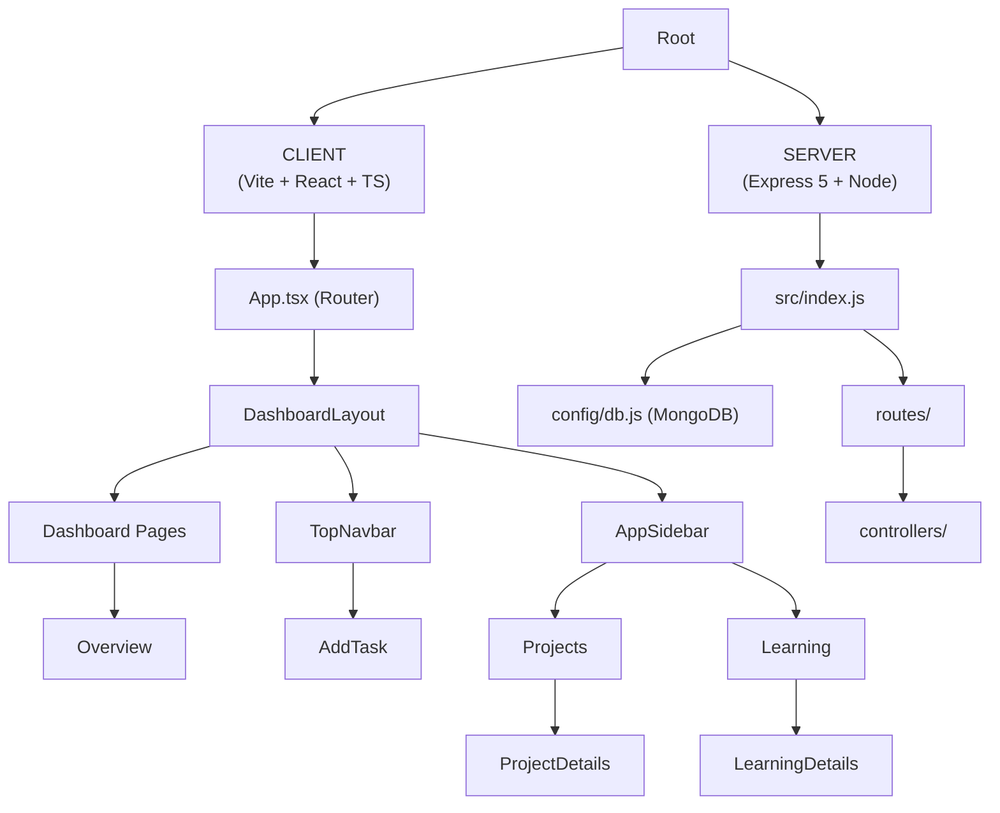
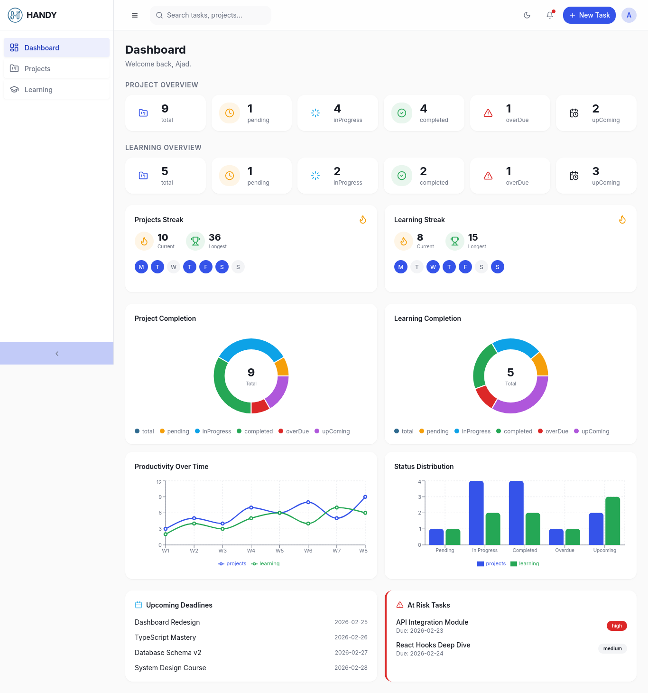
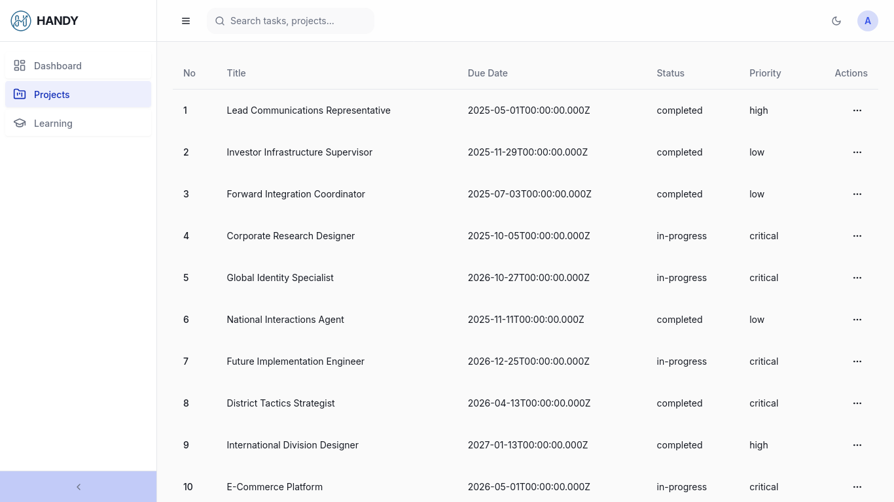
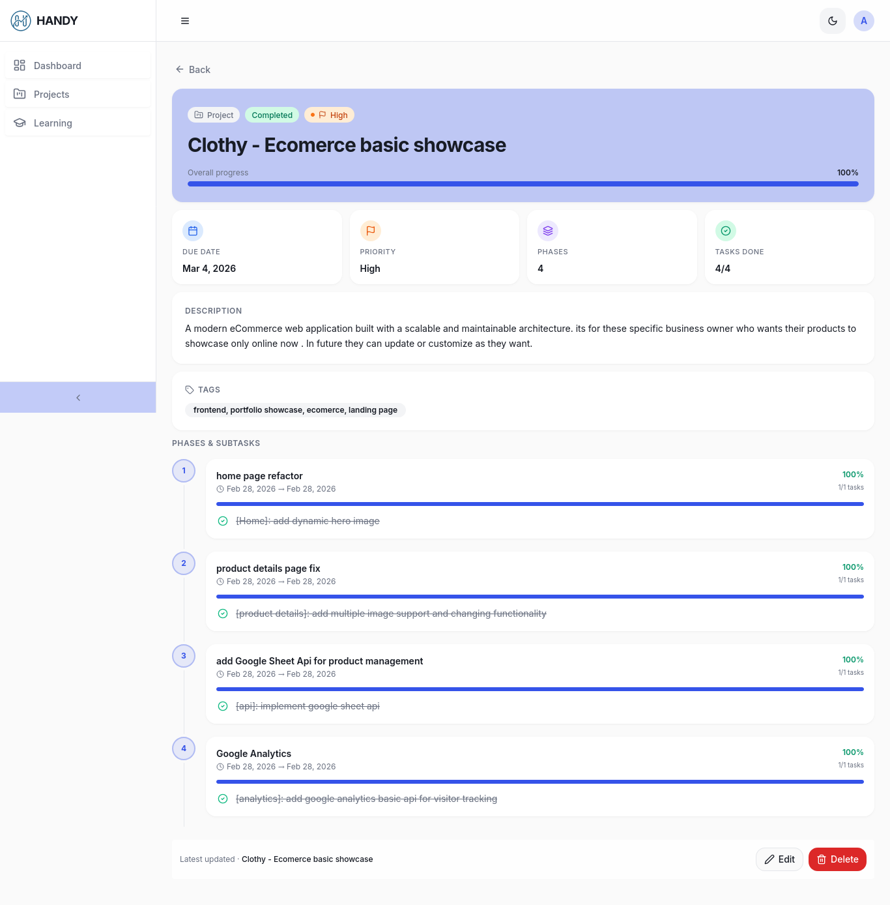

# Project Name : HANDY | Project Task and Learning Management Application 

## Project Overview
HANDY is a full-stack project and learning management application designed to streamline personal productivity through structured project tracking, progress analytics, and streak-based motivation. It features a modern React + Vite + TypeScript client with a scalable Express and MongoDB backend for efficient data handling. The platform centralizes tasks, learning plans, and performance insights in a clean, dashboard-driven workflow.

---

## ⏱️ Timeline

- **Duration**: 14 days
- **Dead Line**: 22 February 2026 - 8 March 2026
- **Completed**: under Development

---

## Live URL
<a href='https://handy.vercel.app' target='_blank' > visit website </a>

---

## GitHub Badges


---

## Tech Stack
- **Frontend Framework**: React
- **Backend Framework**: Express + Node
- **Database**: Mongo DB
- **Build Tool**: Vite
- **Language**: Typescript
- **Styling**: Tailwind CSS
- **Package Manager**: pnpm

---

## Features [client]
**Modern Dashboard**
- stats 
- daily streak
- chart [project, learning, productivity, status]
- Alert: upcoming Deadlines, At Risk Tasks

**Add Task Page**
**Projects List Page**
**Learnings List Page**
**Project Details Page**
**Learning Details Page**
**Not Found Page**
**Dark/Light Theme**
**vercel frontend Deployment**
**render backent Deployment**

## Features [backend]
**Task Management**
**States Return**

---

<!-- ---

## 📁 Project Structure
```txt
src/
├── assets/        # Static assets (images, icons)
├── components/    # Reusable UI components
├── pages/         # Application pages/views
├── index.css/        # Global styles
├── App.jsx
└── main.jsx
```
--- -->

## 🏗️ System Architecture



---

## Deployed

this client side website has been deployed to `VERCEL` and server has been in `RENDER`.

---

## Screenshots

| Name | Screenshot |
|------|------------|
| Dashboard Page |  |
| Lists Page |  |
| Project Details Page |  |

---

## Installations:

### Prerequisites
- **Node.js** >= 18
- **npm** >= 9

### [1]: Clone the munna repository

```bash
git clone git@github.com:yasinarafatajad/handy.git;
cd handy
```

### [2] Install pnpm
```bash
npm install -g pnpm

```

### [3] Packege install
Install the required packages:
```bash
pnpm install

```
### [4] Development
Start the development with hot module replacement:
```bash
pnpm dev

```

### [5] Build for Production
Start the production :
```bash
pnpm build
    
```

---

## 👤 Author
**Yasin Arafat Azad**  
Full-Stack Web Developer (MERN)

---

## 📄 License
This project is licensed under the **MIT License**.  
See the `LICENSE` file for details.

---
